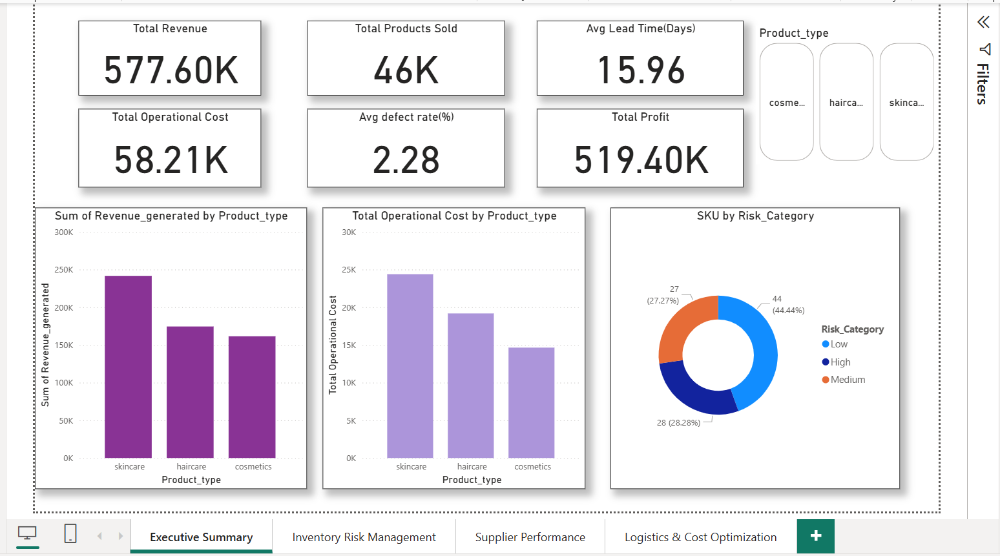
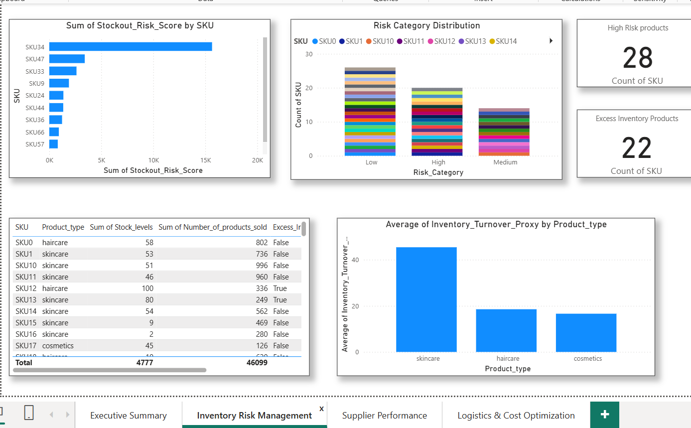
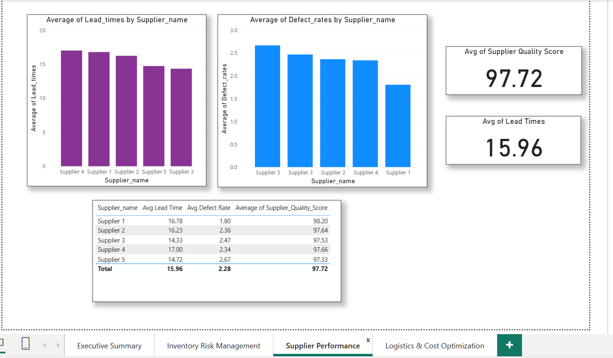
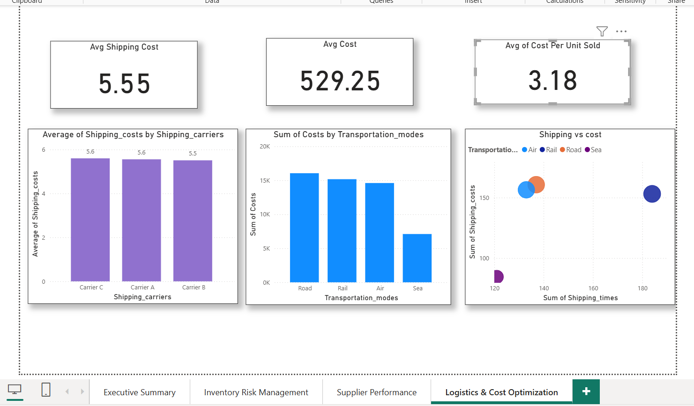

# Supply Chain Operations Analytics

## 📊 Dashboard Preview

🔗 **[View Live Dashboard](your-published-powerbi-link-here)** *(optional — add once published)*

---

## Overview

End-to-end supply chain analytics solution built to improve inventory visibility, operational efficiency, and data-driven decision-making across 100+ products using SQL, Python, and Power BI.

---

## Problem Statement

Modern supply chains struggle with:
- Stockouts and overstocking
- Inventory imbalance across products
- Limited visibility into operational and supplier performance
- Inefficient inventory allocation decisions

---

## Key Results

- **Identified 28 high-risk SKUs** using custom KPI frameworks (Stockout Risk Score, Excess Inventory Flag, Supplier Quality Index)
- **Reduced manual reporting effort by ~20%** through SQL and Python-based ETL pipelines
- **Found air freight costs 7× more than road/rail transport**, and recommended carrier adjustments projected to cut unit logistics costs from **₹7.22 to ₹0.13**
- Improved visibility into supplier delays, defect rates, and operational performance across 100+ products

---

## Tools & Technologies

- **SQL** — data extraction, joins, aggregations, KPI calculation
- **Python (Pandas, NumPy)** — data cleaning, EDA, ETL automation
- **Power BI** — interactive dashboards and KPI tracking
- **Excel** — data validation and exploratory analysis

---

## Key KPIs Tracked

- Stockout Risk Score
- Excess Inventory Flag
- Supplier Quality Index
- Inventory Turnover
- Order Fulfillment Rate
- Demand vs Supply Analysis

---

## Methodology

- Built SQL and Python-based ETL pipelines to integrate operational datasets across inventory, suppliers, and logistics
- Designed custom KPI frameworks to flag high-risk SKUs and excess inventory in real time
- Analyzed freight mode costs (air vs road vs rail) to identify and quantify cost-saving opportunities
- Built an interactive Power BI dashboard to monitor inventory health, demand-supply trends, and product-level performance

---

## Business Impact

- Flagged 28 SKUs at risk of stockout, enabling proactive inventory action
- Cut manual reporting effort by ~20% through automation
- Surfaced a logistics cost-saving path from ₹7.22 to ₹0.13 per unit via freight mode changes
- Improved supplier performance visibility (delays, defect rates) for better vendor evaluation

---

## Additional Dashboard Views

| Inventory Risk Management | Supplier Performance |
|---|---|
|  |  |

---

## Limitations

- Dataset reflects a fixed time period and may not capture seasonal demand shifts beyond what's covered
- Freight cost recommendations are based on historical averages, not real-time carrier pricing
- KPI thresholds (e.g. stockout risk) were manually defined, not derived from optimization models

---

## Future Scope

- Incorporate real-time supplier and logistics data feeds
- Apply demand forecasting models (e.g. time series) to anticipate stockouts proactively
- Automate KPI threshold tuning using historical performance data
- Expand freight cost analysis to include real-time carrier rate comparisons

---

**Author:** Jahnavi Jammi
Aspiring Data Analyst | SQL · Python · Power BI
